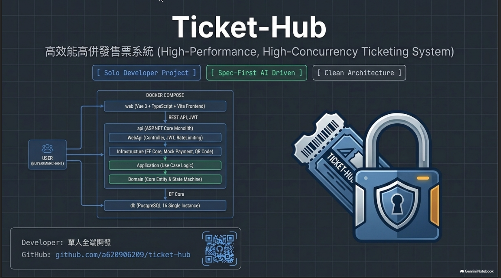
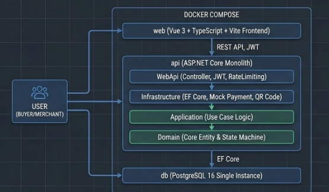

# Ticket-Hub — 高效能高併發售票系統



> 個人作品專案，主軸情境為「熱門活動搶票」：抗高併發、防超賣、防黃牛，並涵蓋建立活動 → 選位/購票 → Mock 付款 → 出票（QR Code）→ 現場核銷的完整流程。
>
> 本 README 為求職 / 面試展示用途，說明專案範疇、技術棧、目前完成度，以及開發過程中如何與 AI 協作（含實際使用的工具與工作流程，而非僅是「有用 AI 寫程式」的空泛說明）。
>
> GitHub Repository：[github.com/a620906209/ticket-hub](https://github.com/a620906209/ticket-hub)
>
> 專案內的 C# 命名空間沿用開發初期代號 `ProjectC.*`（`ProjectC.Domain`／`ProjectC.Application` 等），對外產品名稱統一為 **Ticket-Hub**，兩者指同一個專案。

---

## 1. 專案定位

以「情境 B：高併發防黃牛」為主軸的售票系統，核心目標依優先順序：

1. **抗高併發與庫存一致性**（不超賣、開賣不當機）
2. **防黃牛 / 防機器人搶票**（Rate limiting、排隊機制）
3. **售票效率**（主辦方自助上架、買家流暢結帳）

技術驗證指標：模擬 **500 併發**搶購同一場次 **50 張票**，目標 **0% 超賣**、**P95 回應時間 < 500ms**。

完整範疇規劃見 [`docs/project-scope.md`](docs/project-scope.md)。

## 2. 技術棧

| 分類 | 選型 |
|---|---|
| 後端 | C# / .NET 10（ASP.NET Core，Controller-based MVC） |
| 前端 | Vue 3（Composition API + `<script setup>`）+ TypeScript + Vite |
| 資料庫 | PostgreSQL 16 |
| ORM | Entity Framework Core |
| 認證 | JWT（Access Token + Refresh Token） |
| 限流 | `Microsoft.AspNetCore.RateLimiting`（分區限流，搶購端點 + 登入端點各自獨立 policy） |
| 電子票券 | QRCoder（本地產生 QR Code，內容為 HMAC 簽章過的 Ticket ID，防偽造） |
| 驗證 | FluentValidation |
| 測試 | xUnit + FluentAssertions + Moq + Testcontainers（PostgreSQL 整合測試） |
| 靜態分析 | SonarAnalyzer.CSharp + Microsoft.CodeAnalysis.NetAnalyzers |
| 容器化 | Docker Compose（本機開發全流程容器化，不需在主機安裝 .NET SDK / Node.js / PostgreSQL） |

## 3. 架構



本機以 Docker Compose 部署三個 service（`web` / `api` / `db`），`api` 內部採 Clean Architecture 分層，依賴方向由外向內單向：

```
WebApi → Infrastructure → Application → Domain
```

- **Domain**：Entity、狀態機、Repository 介面定義；不依賴任何其他層。
- **Application**：跨 Entity 協調邏輯、DTO；只依賴 Domain。
- **Infrastructure**：EF Core 實作、Mock 金流、QR Code 產生等技術細節。
- **WebApi**：Controller、DI 註冊、middleware（含全域例外處理、JWT 驗證、限流）。

核心實體關係：

```
Organizer → Event → TicketType（RequiresSeat 開關：座位制／純計數制）
                          ↓（座位制才存在）
                        Seat
Order → OrderItem → Ticket（電子票券，核銷用）
```

座位鎖定採**悲觀鎖**（資料庫交易鎖 + 固定順序取鎖避免死鎖），純計數票種庫存扣減沿用同一套模式。

## 4. 功能完成度

依 MoSCoW 分級（完整規劃見 [`docs/project-scope.md`](docs/project-scope.md) 第 2 節）：

**Phase 1（Must）— 已全數完成**，核心流程可 end-to-end 跑通：

- 活動 / 票種建立與上架（座位制、純計數制兩種模式）
- 座位選擇與鎖定（悲觀鎖，防死鎖）
- 訂單建立與結帳流程（`IPaymentGateway` 抽象化 + Mock 實作，展示依賴反轉）
- 電子票券產出（QR Code + HMAC 簽章防偽造）
- 核銷 API（`PATCH /api/admin/tickets/{id}/redeem`，併發防重複核銷、狀態機驗證）
- 會員系統整合登入（JWT）
- 前端 RWD（買家購票/訂單查詢、主辦方管理後台）

**Phase 2（Should）— 已全數完成**：

- 主辦方銷售報表（依票種彙總營收/售出張數）
- Rate limiting / 排隊機制（搶購端點分區限流）
- 登入 Rate limiting（防暴力破解）
- Email 通知（`IEmailNotificationService` 介面 + Mock 實作，結構化 log 記錄）

**Phase 3（Could）— 規劃中，視情況擴充**：Redis 分散式鎖、多租戶管理介面、CAPTCHA、現場核銷掃碼前端頁面等。

## 5. 本機執行

所有服務跑在 Docker Compose 容器內，**不需要在本機安裝 .NET SDK / Node.js / PostgreSQL**。

```bash
# 1. 複製環境變數範本並依需要調整（JWT/HMAC 簽章金鑰務必自行更換）
cp .env.example .env

# 2. 啟動全部服務
docker compose up -d

# API：http://localhost:8080（Swagger UI 見 /swagger）
# 前端：http://localhost:5173
```

修改 `src`／`web/src` 下的原始碼會透過 bind mount 觸發 hot reload，不需重啟容器；新增 NuGet 套件或 npm 套件才需要 `docker compose restart api` / `web`。

### 測試

```bash
# 後端（xUnit，含 Testcontainers 整合測試）
docker compose exec api dotnet test

# 前端（Vitest）
docker compose exec web npm run test
```

## 6. 開發流程：Spec-First + AI 協作

這個專案刻意採用**先寫規格、審查通過再實作**的流程，而非直接讓 AI 產生程式碼——目的是控制 AI 輔助開發常見的風險（規格漂移、審查盲點、樣板程式碼掩蓋邏輯錯誤）。以下是實際使用的工具與分工，不是通用的「有用 Copilot」描述。

### 6.1 使用的 AI 工具

- **Claude Code**：主要的 pair-programming 工具，負責規格撰寫、程式碼實作、測試撰寫、程式碼審查。
- **Devin**：`.devin/agents/` 鏡射 `.claude/agents/` 的審查規則，作為第二個 AI 工具的交叉查核（兩者規則需人工同步，非自動鏡射）。

### 6.2 規格驅動流程（OpenSpec）

功能開發不是「描述需求後直接生成程式碼」，而是走固定流程：

```
branch-and-propose → openspec-propose（產出 proposal/design/tasks/specs）
    → spec-reviewer 審查規格
    → openspec-apply-change（依 tasks 逐項實作）
    → strict-reviewer 審查程式碼變更
    → openspec-archive-change（歸檔並同步正式 specs）
```

每個階段對應一個自訂 Claude Code Skill 或 Subagent：

| 元件 | 類型 | 職責 |
|---|---|---|
| `spec-scope` | Skill | 專案初期一次性宏觀需求盤點，產出 `docs/project-scope.md` |
| `branch-and-propose` | Skill | 從 master 同步、開新分支、進入提案流程 |
| `openspec-propose` | Skill | 產出單一功能的 proposal / design / tasks / specs |
| `spec-reviewer` | Subagent | **實作前**審查規格文件：需求完整性、邊界情況、安全與權限需求、AC 與測試任務雙向對應、與既有規格一致性 |
| `openspec-apply-change` | Skill | 依 tasks 清單逐項實作 |
| `hardener` | Skill | Application / Repository 層程式碼變更完成後，套用防禦性檢查清單（參數驗證、Entity 存在性、狀態機驗證、並發處理、`CancellationToken` 傳遞、例外邊界、日誌遮蔽） |
| `strict-reviewer` | Subagent | **實作後**審查 git 變更：測試覆蓋、Clean Architecture 分層、EF Core 使用、安全性、命名慣例，並在容器內實際執行測試 |
| `openspec-archive-change` | Skill | 完成後歸檔提案、同步正式 specs |

規格文件保留在 [`openspec/changes/archive/`](openspec/changes/archive/)（每個功能一份 proposal/design/tasks/specs），可對照 git 歷史逐一檢視每個功能從規劃到實作的完整過程。

### 6.3 AI 審查的實際限制（誠實揭露）

多輪自動化審查（`spec-reviewer` + `strict-reviewer` 兩層，甚至同一功能審過多次都回報 PASS）**不代表沒有問題**。開發過程中多次是由人工複審才抓到自動化審查漏掉的問題，例如：

- 併發情境下 `ChangeTracker` 快取與資料庫實際狀態不一致
- Mock 實作掩蓋了真實資料庫層級的邊界情況
- 同一個修正 pattern 沒有同步套用到相似的另一處
- 測試 fixture 的影響範圍未完整列舉，改動波及未預期的測試

因此實際流程是「AI 兩層自動審查 + 人工複審」為最終把關，AI 審查降低了人工複審的工作量，但不能取代它。這點刻意寫在這裡，是因為它是這個專案在「如何負責任地使用 AI 輔助開發」上最真實的心得，而不是行銷話術。

## 7. 專案結構

```
src/
  ProjectC.Domain/          # Entity、狀態機、Repository 介面
  ProjectC.Application/     # Use case 協調邏輯、DTO
  ProjectC.Infrastructure/  # EF Core、Mock 金流、QR Code、Email 等實作
  ProjectC.WebApi/          # Controller、DI 註冊、middleware
tests/                      # 對應四層各自的測試專案（xUnit）
web/                        # Vue 3 前端（買家 + 主辦方後台）
openspec/
  changes/archive/          # 已完成功能的規格文件（proposal/design/tasks/specs）
  specs/                    # 目前正式規格（單一事實來源）
docs/project-scope.md       # 專案宏觀範疇盤點
.claude/agents/             # spec-reviewer / strict-reviewer 審查規則定義
.claude/skills/             # 自訂 OpenSpec 工作流 Skill
.devin/agents/              # Devin 對應的審查規則（人工同步 .claude/agents）
```
